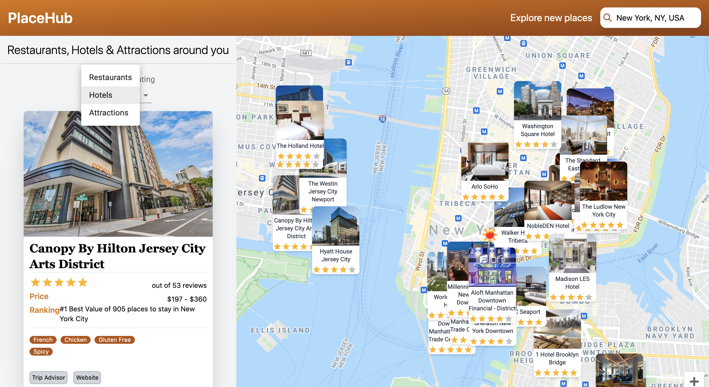

## Place Hub





## About Site

Build an advanced Travel Companion Application using Google Maps. With Geolocation, Google Maps API, Searching for places, Fetching restaurants, hotels and attractions based on location from specialized Rapid APIs, data filtering and much more. Inspired by Javascript Mastery.

## Tech Stack

React JS, Tailwind CSS, Styled Components, CSS, HTML.

## Run Instructions

```
npm i 
npm start
```

## API Used
RAPID API TRAVEL ADVISORY, RAPID API OPEN WEATHER MAP
